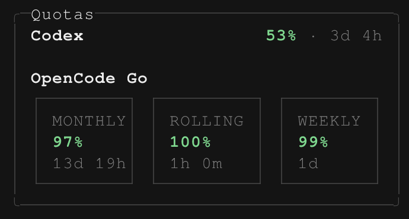

# Quota usage

Shows remaining Codex and OpenCode Go account quota in OpenCode chat and the TUI sidebar. These are account allowances, not token totals for the current session.

## Install

Use [OpenCode V2](https://opencode.ai/v2/docs/) with an active connection to at least one supported provider. Merge this entry into your `opencode.jsonc`:

```jsonc
{
  "$schema": "https://opencode.ai/config.json",
  "plugins": ["github:mholtzscher/opencode-plugins#main::path:quota-usage"],
}
```

OpenCode installs the package and loads its server and TUI entries. No checkout, manual dependency install, plugin options, or extra skills are needed. Keep only one copy of the plugin in your configuration. See [OpenCode's plugin guide](https://opencode.ai/v2/docs/plugins) for updates and reloads.

Run `/connect` to add or activate an account. See [provider accounts](https://opencode.ai/v2/docs/cli/providers) for the authentication steps.

| Provider | Credentials | Display |
| --- | --- | --- |
| Codex, `openai` | ChatGPT account sign-in, not a standard OpenAI API key | Weekly quota remaining |
| [OpenCode Go](https://opencode.ai/v2/docs/console/go), `opencode-go` | API key for an active Go subscription | Monthly, rolling, and weekly quotas when returned |

For local development, see [DEVELOPMENT.md](./docs/DEVELOPMENT.md).

## Use in chat

Ask in web or TUI chat:

```text
Show my quotas.
How much Codex quota do I have left, and when does it reset?
```

The agent chooses whether to call `quota_usage`. The tool takes no arguments and fetches fresh usage for every supported provider available in the current project. It returns remaining percentages and any reset times the provider supplies. There is no provider selector or quota slash command. Web chat needs the plugin on its OpenCode server, not a browser extension.

## Read the TUI panel



The Quotas sidebar panel refreshes on startup, every minute, and after successful session execution. Reset countdowns update every minute. Green means more than 30% remains, yellow means 30% or less, and red means 10% or less.

Only supported providers available in the current project appear. If neither is available, the panel stays hidden and the tool returns an empty provider list. The panel and chat tool fetch independently, so their snapshots can differ.

## Requests and approvals

The plugin adds no approval prompt before fetching usage. TUI polling runs automatically, without an agent tool call.

The server resolves the active account credentials and sends authenticated requests to `chatgpt.com` or `opencode.ai`. Credentials do not go to the TUI or agent tool output. The plugin does not change files, account settings, or the selected model. It reports quota but does not stop model requests when quota is low.

## Troubleshooting and limits

| Symptom | What to do |
| --- | --- |
| No panel or an empty tool result | Check that the plugin is active and `/connect` has an active supported provider for this project. |
| The tool reports `Unable to list quota providers` | Retry the lookup. If it still fails, check the OpenCode server's provider configuration. |
| Codex says `Usage unavailable` | Activate a ChatGPT account connection. A standard OpenAI API key cannot supply Codex account quota. If needed, sign in again. |
| OpenCode Go says `Usage unavailable` | Check the active Go account and subscription. Confirm the OpenCode server can reach `opencode.ai`. |
| One provider is unavailable | Check its connection and server network access. A request times out after 15 seconds. The other provider's result remains available. |
| Values look stale | Wait for the next minute refresh or ask for a fresh chat lookup. If the TUI cannot synchronize the provider list, it keeps the previous snapshot. |
| A window or reset countdown is missing | The provider may omit that data. Compare with the provider's account usage page. |

The plugin shows only the Codex window labeled Weekly, not its short-term limit. If the response has no explicit seven-day window, it uses the last available window with that label. OpenCode Go shows only usable monthly, rolling, and weekly windows. Unsupported response formats produce `Usage unavailable`; the plugin does not report the underlying error.

There is no manual panel-refresh command or configurable polling interval. Provider endpoint URLs are fixed; changing a model's `baseURL` does not redirect quota requests.
